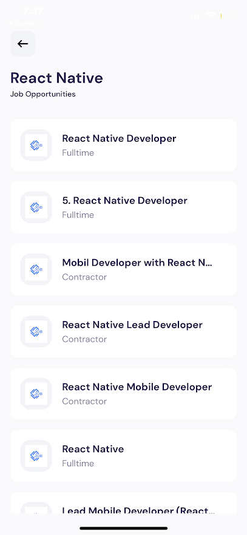

<h3 align="center">React Native Job App</h3>

  <a href="https://expo.dev/@realbcole/react_native_jobs?serviceType=classic&distribution=expo-go">Live Demo</a>

---

 Job Search App built in React Native
      

## NOTE

The QR Code in the live demo link only works for Android. If you cannot test the app yourself, check out the documentation.

## 📝 Table of Contents

- [About](#about)
- [Purpose](#purpose)
- [Built Using](#built_using)
- [Screenshots](#screenshots)
- [Credits](#credits)

## 🧐 About 

React Native job finder app using Expo and the JSearch API

## Purpose 

Learn React Native

## ⛏️ Built Using 

- [React Native](https://reactnative.dev/) - Web framework
- [Expo](https://expo.dev/) - Tooling & Deployment
- [JSearch](https://rapidapi.com/letscrape-6bRBa3QguO5/api/jsearch) - Job Data

## Screenshots 

## ✍️ Credits 

- [JavaScript Mastery](https://www.youtube.com/watch?v=mJ3bGvy0WAY) - Tutorial
